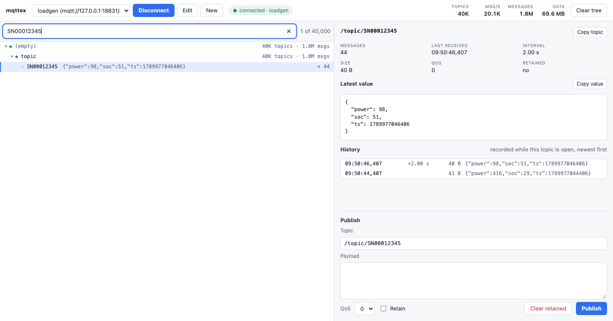

# mqttex

An MQTT 5 explorer for brokers with a lot of topics. It stays responsive with tens of thousands of topics and tens of thousands of messages per second, where GUI explorers that store or render every message fall over.

One Go binary, no database, UI in your browser.



## Features

- Live topic tree with message counts, subtree totals and an activity indicator per row
- Instant filter over all topics (several terms are combined with AND, `/` focuses the input)
- Per-topic view: latest value (JSON is pretty-printed), message history with millisecond timestamps and the interval between messages, so you can see at a glance whether a device is still pushing
- Publish with QoS and retain, and clear retained messages
- Saved connection profiles: mqtt, mqtts, ws, wss, username/password, several subscriptions
- Connection problems are shown with their cause: refused connections, failed authentication and subscriptions the broker rejected (for example because of an ACL)
- Keyboard navigation in the tree, light and dark mode

## Install

Requires Go 1.27 or newer.

```bash
go install github.com/silasmartin/mqttex@latest
mqttex
```

Or build it from source:

```bash
git clone https://github.com/silasmartin/mqttex.git
cd mqttex
go build -o mqttex .
./mqttex
```

The UI opens at `http://127.0.0.1:18830`. Create a connection with **New**, then press **Connect**.

Subscriptions are MQTT topic filters: `#` matches all remaining levels, `+` matches exactly one level. `*` is not a wildcard. If your topics start with a slash, the filter has to as well: `/devices/#`, not `devices/#`.

### Flags

| Flag | Default | |
|---|---|---|
| `-addr` | `127.0.0.1:18830` | address the UI is served on |
| `-profiles` | `<user config dir>/mqttex/profiles.json` | connection profiles file |
| `-max-topics` | `2000000` | stop adding topics beyond this number |
| `-no-open` | | do not open the browser on start |
| `-web` | | serve the UI from a directory instead of the embedded copy (development) |

## How it handles the load

- **Ingest is one map lookup.** Every message updates an in-memory topic table (about 20 ns, no allocation). Nothing is written to disk and no per-message event is emitted.
- **The browser gets state, not events.** Five times per second each browser receives what changed since its last update: new topic names (once), message counts as a binary frame, payload previews only for the rows currently on screen, and full messages only for the topic that is open. A slow browser simply gets fewer, larger updates and never causes message loss.
- **The tree is virtualized.** 40 000 visible rows are rendered with a few dozen DOM nodes.

Measured on an Apple M5 Pro against a local broker with 40 000 topics:

| Load | Server | Browser |
|---|---|---|
| 20 000 msg/s | 22 % of one core, 83 MB | 60 fps, no long tasks |
| 100 000 msg/s | 76 % of one core, 85 MB | 60 fps, 18 MB JS heap |

History is recorded for a topic while it is open (last 500 messages). All other topics keep only their latest message. Nothing survives a restart.

## Security

- mqttex has no login. It binds to loopback by default; if you pass a non-loopback `-addr`, everyone who can reach the port can use your saved broker credentials.
- Cross-origin requests, WebSocket connections from other origins and requests with a foreign `Host` header are refused, so another website open in your browser cannot drive the API.
- Profiles, including passwords, are stored as plain text in the profiles file with mode `0600`. The API never returns a stored password.

## Development

```bash
go test -race ./...            # unit tests and an end-to-end test against an embedded broker
node --test web/tree.test.js   # topic tree model
go run . -web web              # serve the UI from disk while editing it
```

`cmd/loadgen` starts a local broker and floods it, so you can try mqttex under load without touching a real broker:

```bash
go run ./cmd/loadgen -topics 40000 -rate 20000   # broker on mqtt://127.0.0.1:18831
```

The frontend is plain JavaScript and CSS without a build step. `web/tree.js` holds the tree model and has no DOM dependency.

## License

[MIT](LICENSE)
